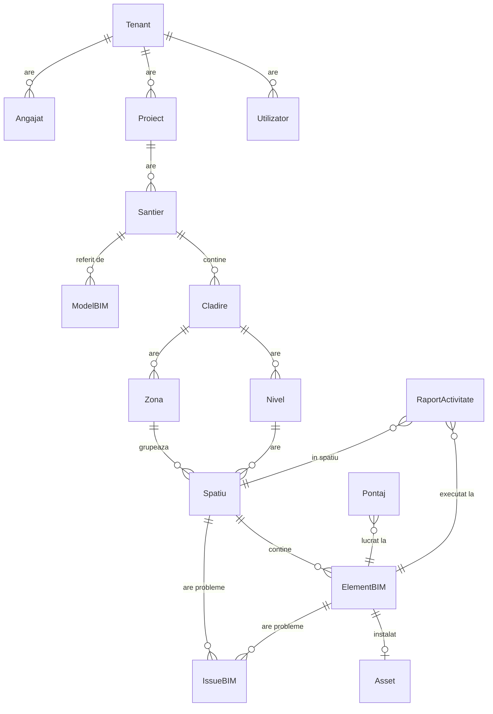

# BIM Domain Model — Faza 1 (Foundation)

## Context

Aceasta este prima fază a transformării workforce → BIM-aware platform.
Toate modelele BIM sunt **aditive** și **opționale**: workforce-ul existent
continuă să funcționeze fără ele. Coloanele FK adăugate pe tabelele
workforce (Pontaj, RaportActivitate) sunt nullable.

## Principii

1. **Backward compatibility** — orice DB existent funcționează fără modificare.
2. **Nullable everywhere** — toate coloanele FK BIM pe workforce sunt nullable.
3. **IFC-aligned** — codurile pentru tipuri de elemente folosesc terminologia IFC (EN),
   labels-urile UI sunt în RO.
4. **Multi-tenant ready** — fiecare entitate de tip "tenant-scoped" are
   `tenant_id` nullable, plus modelul `Tenant`.
5. **Cale ierarhică explicită** — Spațiu → Nivel → Clădire → Șantier (proprietate
   `cale_completa` pe ElementBIM).

## Diagramă ER (simplificată)



## Tabele BIM (Faza 1)

| Tabel | Rol | Părinte |
|---|---|---|
| `tenants` | Tenant multi-tenant | — |
| `bim_santiere` | Șantier (BIM Site) - locație geografică | `proiecte` (opt.) |
| `bim_cladiri` | Clădire | `bim_santiere` |
| `bim_niveluri` | Nivel/etaj | `bim_cladiri` |
| `bim_zone` | Zone funcționale | `bim_cladiri`, `bim_niveluri` (opt.) |
| `bim_spatii` | Spațiu/cameră | `bim_niveluri`, `bim_zone` (opt.) |
| `bim_elemente` | Element fizic (perete, ușă, AHU, ...) | `bim_spatii`, `bim_niveluri`, `bim_cladiri` |
| `bim_assets` | Component instalat (1:1 cu ElementBIM) | `bim_elemente` |
| `bim_issues` | Probleme BIM (compatibil BCF) | `bim_elemente`/`bim_spatii`/`bim_niveluri`/`bim_cladiri` |
| `bim_modele` | Referințe către modele IFC/Revit | `bim_santiere`, `bim_cladiri` |

## Coloane workforce → BIM (FK nullable)

| Tabel workforce | Coloană | Pointează către |
|---|---|---|
| `utilizatori` | `tenant_id` | `tenants.id` |
| `utilizatori` | `limba` | (string `ro`/`en`, default `ro`) |
| `angajati` | `tenant_id` | `tenants.id` |
| `proiecte` | `tenant_id` | `tenants.id` |
| `rapoarte_activitati` | `element_bim_id` | `bim_elemente.id` |
| `rapoarte_activitati` | `spatiu_id` | `bim_spatii.id` |
| `rapoarte_activitati` | `zona_id` | `bim_zone.id` |
| `pontaje` | `element_bim_id` | `bim_elemente.id` |
| `pontaje` | `spatiu_id` | `bim_spatii.id` |

## Tipuri elemente IFC suportate (Faza 1)

Categorii: `structural`, `arhitectural`, `mep_hvac`, `mep_sanitare`,
`mep_electric`, `mep_automatizari`, `mep_pci`, `mep_transport`, `general`.

Coduri (din `ElementBIM.TIPURI`):

- **Structural**: `wall`, `slab`, `beam`, `column`
- **Arhitectural**: `door`, `window`, `stair`, `railing`
- **MEP HVAC**: `AHU`, `chiller`, `fan`, `duct`
- **MEP Sanitare**: `pump`, `valve`, `pipe`
- **MEP Electric**: `cable_tray`, `light`, `outlet`, `switch`, `panel`
- **MEP Automatizări**: `sensor`
- **MEP PCI**: `sprinkler`, `extinguisher`
- **MEP Transport**: `elevator`
- **General**: `alte`

## Migrare

```bash
# Local sau pe PA, dupa ce face git pull pe branch:
flask migrate-bim
```

Comanda este **idempotentă**:
- creează tabele BIM lipsă (sare peste cele existente),
- adaugă coloane FK pe tabele workforce (sare peste cele deja prezente),
- nu șterge nimic.

## Status workflow & status execuție pe ElementBIM

Status tipic (în `ElementBIM.status`):
- `proiectat` — există în model BIM dar nu e încă executat.
- `in_executie` — în lucru pe șantier.
- `executat` — terminat fizic.
- `verificat` — verificat de inginer/diriginte.
- `receptionat` — recepționat formal.
- `defect` — necesită intervenție.

## Tests

`tests/test_bim_models.py` validează:
- existența tabelelor (10 BIM + tenant)
- ierarhie completă (santier → cladire → nivel → spațiu → element)
- helpers (`tip_label`, `tip_categorie`, `cale_completa`)
- garanție asset, lookup mentenanță
- 1:1 element ↔ asset
- Issue poate referi orice nivel ierarhic
- coloanele FK workforce → BIM există după migrare
- unicitatea `Tenant.cod`

## Următoarele faze

**Faza 2** — backend services + API:
- `routes/bim_santiere.py`, `routes/bim_cladiri.py`, etc.
- API endpoint-uri JSON pentru tree-view ierarhic
- Permisiuni (admin/manager pot edita; operator doar citește)

**Faza 3** — UI/UX:
- Tree-view sidebar pentru navigare BIM
- Pagini pentru fiecare entitate (CRUD)
- Linkare bidirectionala: din formular activitate, selectezi locația BIM
- Filtre pe panourile workforce: filtrează activități după element / clădire

**Faza 4** — Import/Export:
- Import IFC via `ifcopenshell` (parcurge `IfcSite`/`IfcBuilding`/`IfcStorey`/`IfcSpace` și creează entități corespondente)
- Export BCF (issue-urile BIM)
- 3D Viewer integrat (IFC.js) pe pagina de element/clădire
